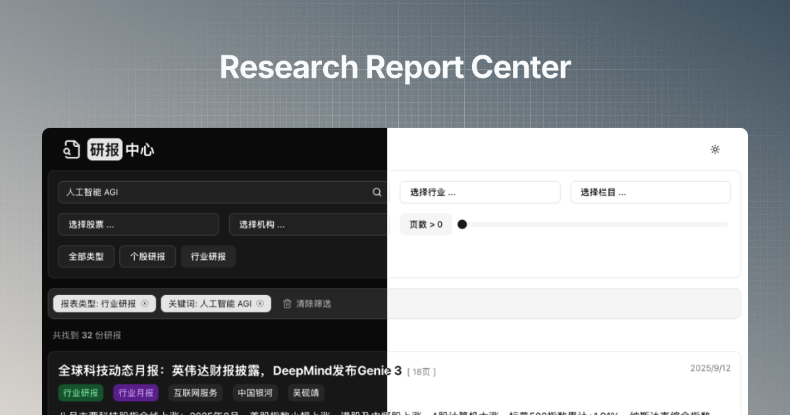

# 研报中心

研报中心是一个 Web 应用程序，用于浏览、搜索和筛选行业与个股研究报告。它提供了一个简洁的界面，帮助用户快速找到相关的金融研究报告。

## 主要功能

- **高级搜索与筛选：** 按报告类型、行业、评级、机构等多个维度筛选报告。
- **分页：** 高效地浏览大量报告。
- **响应式设计：** 在桌面和移动设备上均提供无缝体验。
- **明暗主题切换：** 根据您的偏好在明暗模式之间切换。

## 技术栈

- **框架：** [Next.js](https://nextjs.org/)
- **语言：** [TypeScript](https://www.typescriptlang.org/)
- **数据库与 ORM：** [Prisma](https://www.prisma.io/) & [Turso (libSQL)](https://turso.tech/)
- **UI 和样式：**
  - [Tailwind CSS](https://tailwindcss.com/)
  - [Shadcn/UI](https://ui.shadcn.com/) & [Radix UI](https://www.radix-ui.com/)
  - [Lucide React](https://lucide.dev/) (图标)
  - [next-themes](https://github.com/pacocoursey/next-themes)
- **代码检查：** [ESLint](https://eslint.org/)
